  <!-- dynamic typing effect 动态打字效果 -->
  

    
  

  <picture>
    <source media="(prefers-color-scheme: dark)" srcset="https://cdn.jsdelivr.net/gh/sun0225SUN/sun0225SUN/assets/images/coding.gif" />
    <source media="(prefers-color-scheme: light)" srcset="https://cdn.jsdelivr.net/gh/sun0225SUN/sun0225SUN/assets/images/developer.svg" height="225px" />
    
  </picture>
 
  <!-- for beauty 留个空行 -->
  
&nbsp;

  
  <!-- profile logo 个人资料徽标 -->
  

    &emsp;
    &emsp;
    &emsp;
    <!-- visitor -->
    &emsp;
    <table>
      <tr>
        <td>
          <h3>🤺 About Me</h3>
          
          
&emsp;&emsp;嗨，你好，我是小黄同学。热爱编程、数码、游戏。

          
&emsp;&emsp;热爱软件工程和 IT 互联网事业，希望能成为一名优秀的开发者。

          
&emsp;&emsp;我们正在让这个世界变得更加美好，通过代码的重复使用和延展构建完美体系。

          
&emsp;&emsp;<strong>We're making the world a better place. Through constructing elegant hierarchies for maximum code reuse and extensibility.</strong>

        </td>
      </tr>
      <tr>
        <td>
          <h3>🏢 Work Experience</h3>
          <ul>
            
            <li>
              <a href="https://www.airdoc.com/">北京鹰瞳科技发展股份有限公司</a> &emsp; 📌 2025.09 —— now
              <ul>
                <li>工作职能：中后台服务端开发</li>
                <li>工作内容：负责公司的中后台数据支撑系统的建设与维护</li>
              </ul>
            </li>
            <li>
              
              <a href="http://www.sunny-baer.com/">宁波舜宇贝尔机器人有限公司</a> &emsp;&emsp; 📌 2025.02 —— 2025.08
              <ul>
                <li>工作职能：信息化与数字化软件开发</li>
                <li>工作内容：负责公司的信息化发展，承担数字化业务系统的建设与维护</li>
              </ul>
            </li>
            <li>
              
              <a href="http://www.cnstrong.cn/">杭州施强教育科技有限公司</a> &emsp;&emsp;&emsp; 📌 2024.06 —— 2024.12
              <ul>
                <li>工作职能：Saas系统后端开发</li>
                <li>工作内容：参与“乐课网”平台系统功能板块的迭代开发</li>
              </ul>
            </li>
          </ul>
        </td>
      </tr>
    </table>
  

  <!-- ########################################## 分割 ########################################## -->
  

  <!-- for beauty 留个空行 -->
  
&nbsp;

  <!-- metrics 基础资料 -->
  

  <!-- for beauty 留个空行 -->
  
&nbsp;

  

    <!-- GitHub metrics 信息指标 -->
    <table>
      <tr>
        <td>
          
        </td>
        <td>
          
        </td>
      </tr>
    </table>
  

<!-- GitHub Activity Graph GitHub 活动图 -->
  

<!-- ########################################## 分割 ########################################## -->

<!-- for beauty 留个空行 -->

&nbsp;

  <!--  skill badge 技能徽章 -->
  
  
  
  
  
  
  
  
  
  
  
  
  
  
  <!-- programming tool icon 编程工具图标 -->
   

<!-- just img 图片 -->

